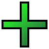
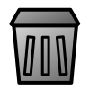
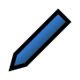
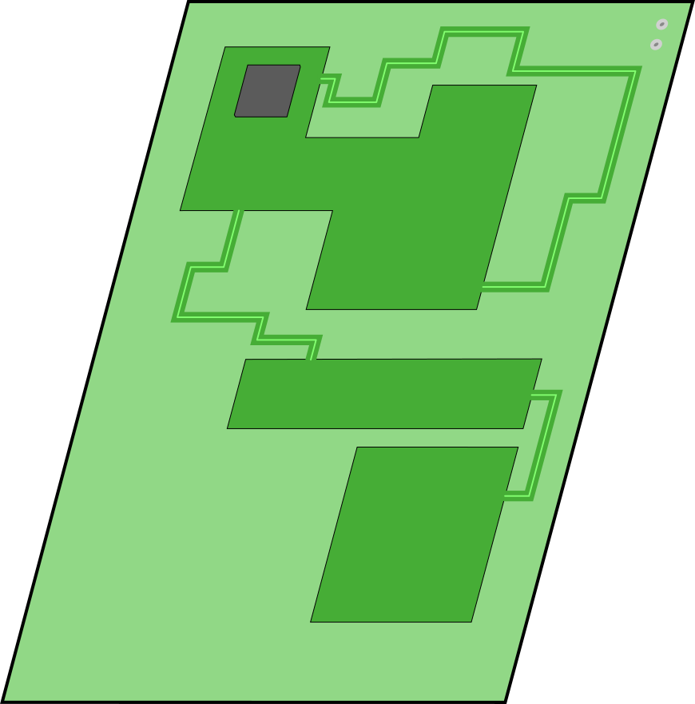
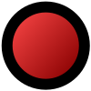
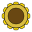

# Free Icons, Symbols and other SVGs
All of these files are released under the CC0-1.0 license (i.e. public domain).  
Put them to good use, please.

## [add.svg](add.svg)

## [Arrow.svg](Arrow.svg)

## [Bar.svg](Bar.svg)

## [Bike.svg](Bike.svg)

## [Burger.svg](Burger.svg)

## [Cross.svg](Cross.svg)

## [delete.svg](delete.svg)

## [edit.svg](edit.svg)

## [Gear2.svg](Gear2.svg)

## [House.svg](House.svg)

## [List.svg](List.svg)

## [Location.svg](Location.svg)

## [Magnify.svg](Magnify.svg)

## [PCB.svg](PCB.svg)

## [Person.svg](Person.svg)

## [play.svg](play.svg)

## [Plus.svg](Plus.svg)

## [Product.svg](Product.svg)

## [rec.svg](rec.svg)

## [Script.svg](Script.svg)

## [Sunflower.svg](Sunflower.svg)

